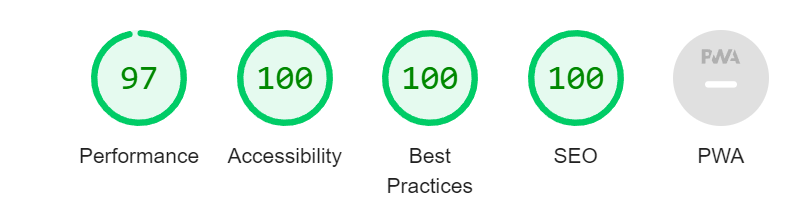

<div align="center" id="top"> 
  

</div>

<h1 align="center">Memento</h1>

## Performances ##

<div align="center" id="top"> 
  

</div>

<br>

## About ##

Projet de création de post-it

## Technologies ##

The following tools were used in this project:

- HTML
- SCSS
- PHP
- MYSQL

## Starting the project ##

```bash
# Clone this project
$ git clone

# Access
$ cd memento

# Install dependencies
$ npm install

# Run script sass
$ "sass" : "sass -w ./src/assets/scss:./src/assets/css"

# Install Database
$ drag and drop the file.gzip into phpMyAdmin
```
